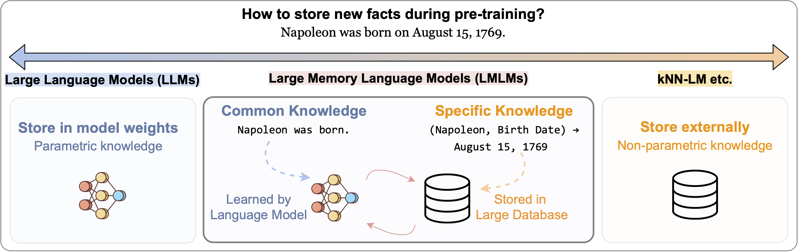
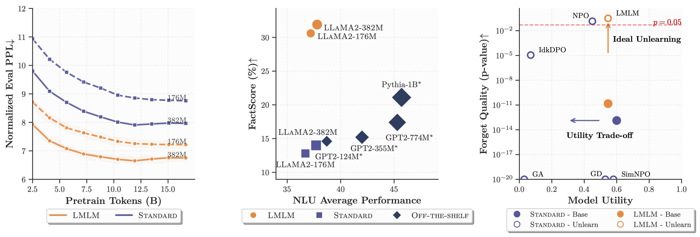
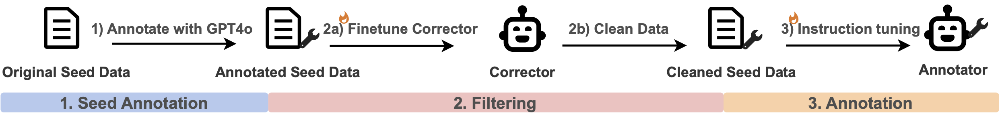

# LMLM🐑: Pre-training Large Memory Language Models with Internal and External Knowledge

<p align="center">
  
</p>

<p align="center">
  <strong>Official repository for the paper:</strong><br>
  <a href="https://arxiv.org/abs/2505.15962">
    <em>Pre-training Large Memory Language Models with Internal and External Knowledge</em>
  </a>
</p>

<p align="center">
  Linxi Zhao, Sofian Zalouk, Christian K. Belardi, Justin Lovelace, Jin Peng Zhou,  
  Kilian Q. Weinberger, Yoav Artzi, Jennifer J. Sun  
  <br>
  <em>Cornell University</em>
</p>


<p align="center">

[📄 Arxiv](https://arxiv.org/abs/2505.15962)  |  [🌐 Project Page](https://linxi-zhao.github.io/LMLM-site/)  |  [🤗 Hugging Face Models](https://huggingface.co/collections/kilian-group/lmlm-models-6862b8091d72eab3891ffbcb) | [🎤 Talk by Kilian @ Simons Institute](https://simons.berkeley.edu/talks/kilian-weinberger-cornell-university-2025-04-03)  | 
</p>

<p align="center">
* <strong>LMLM</strong> is pronounced “LamLam” 🐑
</p>

## 🧠 What is LMLM?

Neural language models entangle language and knowledge, making it hard to verify, update, or forget facts.

**Large Memory Language Models (LMLMs)** address this by combining:

* **Internal memory** (parameters) for fluency and reasoning
* **External memory** (database) for accurate, editable knowledge

This enables:

* Improved perplexity during pretraining
* Higher factual accuracy, without sacrificing general language understanding
* Instant editing or forgetting of specific facts via database updates

<p align="center">
  
</p>
<p align="center">
  
</p>


## Table of Contents
* [Quick Start](#quick-start)
* [Huggingface Pretrained Models and Data](#quick-start)
* [Build Your Own LMLM](#build-your-own-lmlm-pipeline)
* [Data Preparation](#data-preparation)
  * [Annotate Pretraining Corpus](#annotate-pretraining-corpus)
  * [Build External Knowledge Database](#build-external-knowledge-database)
* [Pretraining and Inference](#pretraining-and-inference)
* [Evaluation](#evaluation)
* [Implementation Limitations and TODOs](#implementation-limitations-and-todos)
* [Repository Structure](#repository-structure)
* [Citation](#citation)
* [Acknowledgment](#acknowledgment)

## 🚀 Quick Start


We provide a custom Hugging Face model class `LlamaForLMLM` with a built-in `generate_with_lookup` method.
Below is a minimal example of how to use LMLM for inference.
For the full script, see [`scripts/eval/example_lmlm_inference.sh`](./scripts/eval/example_lmlm_inference.sh).

```python
from transformers import AutoTokenizer
from lmlm.modeling_lmlm import LlamaForLMLM
from lmlm.database import DatabaseManager

tokenizer = AutoTokenizer.from_pretrained(model_path)
tokenizer.pad_token = tokenizer.eos_token

db = DatabaseManager().load_database(database_path) if database_path else None
model = LlamaForLMLM.from_pretrained_with_db(model_path, db_manager=db, use_special_tokens=True).cuda().eval()

output = model.generate_with_lookup(
    prompt='Tell me a bio of Ko Itakura. Ko Itakura is',
    tokenizer=tokenizer,
    max_new_tokens=256,
    enable_dblookup=True,
)
print(model.post_process(output, tokenizer))
```

To reproduce our results? Jump to 👉 [Evaluation](#evaluation)

To build your own LMLM? See 👉 [Build Your Own LMLM](#build-your-own-lmlm-pipeline)

---
## 🤗 Huggingface Pretrained Models and Data

| Category        | Description                                                                 | 🤗 Hugging Face Link                                                                                         |
| --------------- | --------------------------------------------------------------------------- | ------------------------------------------------------------------------------------------------------------ |
| Annotator       | LLaMA-3.1-8B-Instruct, LoRA fine-tuned on LMLM-annotated Wikipedia          | [kilian-group/LMLM-Annotator](https://huggingface.co/kilian-group/LMLM-Annotator)                            |
| LMLM Model      | LLaMA-2-176M pretrained on annotated Wikipedia with external memory                                           | [kilian-group/LMLM-llama2-176M](https://huggingface.co/kilian-group/LMLM-llama2-176M)                        |
| LMLM Model      | LLaMA-2-382M pretrained on annotated Wikipedia with external memory         | [kilian-group/LMLM-llama2-382M](https://huggingface.co/kilian-group/LMLM-llama2-382M)                        |
| Standard Model  | LLaMA-2-176M pretrained on the same data without external memory (baseline) | [kilian-group/Standard-llama2-176M](https://huggingface.co/kilian-group/Standard-llama2-176M)                |
| Standard Model  | LLaMA-2-382M pretrained on the same data without external memory (baseline) | [kilian-group/Standard-llama2-382M](https://huggingface.co/kilian-group/Standard-llama2-382M)                |
| Pretrained Data |  Wikipedia from OLMo2     | [kilian-group/LMLM-pretrain-dwiki6.1M](https://huggingface.co/datasets/kilian-group/LMLM-pretrain-dwiki6.1M) |
| Database        | 54.6M knowledge triplets extracted from the full annotated corpus           | [kilian-group/LMLM-database](https://huggingface.co/datasets/kilian-group/LMLM-database)                     |


## 🛠 Installation

### Standard installation (via Conda)

```bash
conda create -n lmlm python=3.10 -y
conda activate lmlm
pip install -r requirements.txt
```

Option 2: Development mode (editable install)

```bash
pip install -e .
```

### Optional Dependencies

* [TRL](https://github.com/huggingface/trl) – for training
* [LightEval](https://github.com/huggingface/lighteval) – for NLU benchmarks
* [FactScore](https://github.com/shmsw25/FActScore) – for factual precision benchmarks
* [TOFU](https://github.com/locuslab/open-unlearning) – for unlearning benchmarks


---

# 🏗 Build Your Own LMLM Pipeline

This section walks through constructing a full LMLM pipeline.

<p align="center">
  
</p>

## ✍️ Annotator Preparation

### Seed Annotation via GPT-4

Use GPT-4o to annotate a small seed dataset with `[dblookup('Entity', 'Relationship') -> Value]` calls and return values.

```bash
bash scripts/annotate/annotate_gpt4.sh
```

> Requires OpenAI API key in `scripts/account`.
> The prompt can be found in `./prompts/gpt4o-v7.1.md`


### Train an Annotator Model

Fine-tune an LLaMA-3-style model (e.g., LLaMA3.1-8B-Instruct) on cleaned annotations.

```bash
bash scripts/train/ft-llama8b_annotator.sh
```
> The prompt can be found in `./prompts/llama-v6.md`


## 📦 Data Preparation

Once the annotator is trained, use it to label the full pretraining corpus and extract knowledge.


### Annotate the Pretraining Corpus

We use the [OLMo2 Wikipedia corpus](https://huggingface.co/datasets/allenai/dolmino-mix-1124) (\~3B tokens).
Use `vllm` for faster inference. (Annotation over 64 A6000s takes \~2 days.)

```bash
bash scripts/annotate/annotate_annotator.sh
```


### Build the Knowledge Database

Extract structured triplets (entity, relation, value) from the annotations to construct the DB.

```bash
bash scripts/train/extract_database.sh
```

> Final DB contains \~54.6M knowledge triplets.


## 🧪 Pretraining and Inference


### Pretrain LMLM

Train from scratch with masked facts and interleaved retrieval.
Supports GPT-2 and LLaMA2-style models with special tokens for lookup.
All runs use 1024-token context, 8 epochs, and mixed precision.

```bash
bash scripts/train/pretrain.sh
```

> Example: LLaMA2-382M with batch size 256 trained for 105k steps (\~8 H100-days)


### Database Lookup

We use cosine similarity over a sentence transformers (`all-MiniLM-L6-v2`) embeddings
with a threshold of 0.6 for fuzzy matching. See: `lmlm/database/topk_retriever.py` for implementation details.


### Inference with DBLookup

Run LMLM generation with database lookup enabled. The generation examples are in `output/eval/examples`.

```bash
bash scripts/eval/example_lmlm_inference.sh
```

---
# 🔍 Evaluation
<details> <summary>
We provide scripts to evaluate LMLM on perplexity, factuality, unlearning, and NLU tasks. Example evaluation outputs can be found in `output/eval`.

</summary>

> Note: Factuality evaluations depend on database access and may vary with lookup settings.

### 1. Perplexity (Static / Dynamic / Normalized)

Evaluate language modeling performance on a held-out Wikipedia set using three variants of perplexity-
Static (Oracle), Dynamic, Normalized. See `compute_mask_ppl()` in `lmlm/training/utils/utils_metrics.py` for implementation details.


### 2. NLU Benchmarks (LightEval)

Evaluate general language understanding in a zero-shot setting using [LightEval](https://github.com/huggingface/lighteval) on high-signal NLU tasks.


```bash
bash scripts/eval/eval_nlu_task.sh
```


### 3. Factual Precision (FactScore)

Evaluate factual consistency of open-ended biography generation (e.g.,
"Tell me about Kang Ji-hwan. Kang Ji-hwan is...")
using the [FactScore](https://github.com/shmsw25/FActScore) metric, which extracts atomic facts and verifies them.

```bash
bash scripts/eval/eval_factscore.sh
```


### 4. Knowledge Completion (T-REx)

Complete missing factual spans on the [T-REx](https://hadyelsahar.github.io/t-rex/) subset of LAMA (11,615 samples).
Follows the prompt format:
“Jaideep Sahni (born 1968) is an Indian \[MASK]” → `actor`

```bash
bash scripts/eval/eval_trex.sh
```

> Our eval subset: [`here`](./data/trex11k.json)
> [Original T-REx dataset from LAMA](https://dl.fbaipublicfiles.com/LAMA/data.zip)


### 5. Machine Unlearning (TOFU)

Evaluate selective forgetting on the TOFU benchmark from
[Open Unlearning](https://github.com/locuslab/open-unlearning).
Tests whether LMLM can forget a target "Forget Set" while retaining other knowledge.


</details>

---

## Repository Structure
<details>
<summary>
Below is a brief overview of the key directories and files in the LMLM repository.
</summary>

```
LMLM/
├── configs/              # Experiment configurations
├── data/                 # Input datasets and database
├── experiment/           # Python scripts for evaluation
├── output/               # Outputs (annotations, model predictions, eval results)
├── scripts/              # Bash scripts for running experiments
├── src/
│   └── lmlm/
│       ├── annotate/         # Annotation pipeline
│       ├── database/         # Database construction and retrieval
│       ├── training/         # Pretraining and fine-tuning logic
│       ├── modeling_lmlm.py  # LMLM custom model class
│       └── constants.py
├── requirements.txt
├── pyproject.toml
├── README.md

```

</details>

---


## Implementation Limitations and TODOs
<details> <summary>
This is an early-stage implementation of Large Memory Language Models (LMLMs), and there are several known limitations and areas for future improvement. We welcome feedback, contributions, and extensions that push this framework further.
</summary>

* **No batch inference**: The custom model class LlamaForLMLM currently does not support batched generate_with_lookup inference.
* **Fuzzy retrieval**: We use dense embedding similarity over `{entity} {relation}` strings for lookup. While simple, this method is not always accurate. More structured, triplet-aware retrieval methods could improve precision.
* **Fallback behavior when no match is found**: If no relevant entry is found in the database, the model currently either returns the top 1 fuzzy match or defaults to 'unknown'. This behavior may not align with user expectations or training data. Expanding the database, improving lookup precision, or further RL fine-tuning could help address this.
* **Partial database loading**: At inference time, only a subset of the database is loaded due to memory limits. Optimized indexing or caching strategies could further improve efficiency.
* **Annotation format**: We initially used `[dblookup('Entity', 'Relation') -> Value]` via GPT-4o and later converted to special tokens for pretraining using regex. This regex conversion is imperfect and may introduce formatting noise. More robust filtering would improve data quality.
* **Limited scale**: Due to compute constraints, our experiments are limited to small models and datasets.

</details>


---

## Citation

If you find this work helpful, please consider citing:

```bibtex
@misc{zhao2025pretraininglargememorylanguage,
  title={Pre-training Large Memory Language Models with Internal and External Knowledge},
  author={Linxi Zhao and Sofian Zalouk and Christian K. Belardi and Justin Lovelace and Jin Peng Zhou and Kilian Q. Weinberger and Yoav Artzi and Jennifer J. Sun},
  year={2025},
  eprint={2505.15962},
  archivePrefix={arXiv},
  primaryClass={cs.CL}
}
```


## Acknowledgments

We gratefully acknowledge the open-source community. This project builds on the contributions and insights of many prior works.


## License

This project is licensed under the MIT License. See the [LICENSE](./LICENSE) file for details.