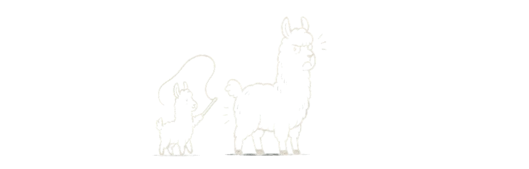

# LMLM🐑🧠 : Pre-training Large Memory Language Models with Internal and External Knowledge

<p align="center">
  
</p>

<p align="center">
  <strong>Official repository for the paper:</strong><br>
  <a href="https://arxiv.org/abs/2505.15962">
    <em>Pre-training Large Memory Language Models with Internal and External Knowledge</em>
  </a>
</p>

<p align="center">
  <strong>Linxi Zhao</strong>, Sofian Zalouk, Christian K. Belardi, Justin Lovelace, Jin Peng Zhou,  
  Kilian Q. Weinberger, Yoav Artzi, Jennifer J. Sun  
  <br>
  <em>Department of Computer Science, Cornell University</em>
</p>

<p align="center">
  📄 <a href="https://arxiv.org/abs/2505.15962">arXiv:2505.15962</a> &nbsp; • &nbsp; 
  <strong>LMLM</strong> is pronounced “LamLam” 🐑
</p>

---

## Updates

* **\[May 2025]**  📢 Paper released! Check out the preprint on [arXiv](https://arxiv.org/abs/2505.15962).
* **\[Coming Soon]**  💻 Code, models, and evaluation scripts will be released. Stay tuned!

---

## Overview

Neural language models entangle linguistic patterns and factual knowledge in billions of opaque parameters. This makes them hard to inspect, update, or control.

We introduce **Large Memory Language Models (LMLMs)** — a new class of models that **combine internal parametric memory with an external knowledge store**. This design enables:

* **Lower perplexity** during pretraining compared to standard LMs
* **Higher factual precision** without hurting NLU task performance
* **Instant forgetting** of facts while preserving general language capabilities
<p align="center">
  
</p>
<p align="center">
  
</p>

---

## Citation

If you find this work useful, please cite:

```bibtex
@misc{zhao2025pretraininglargememorylanguage,
  title={Pre-training Large Memory Language Models with Internal and External Knowledge},
  author={Linxi Zhao and Sofian Zalouk and Christian K. Belardi and Justin Lovelace and Jin Peng Zhou and Kilian Q. Weinberger and Yoav Artzi and Jennifer J. Sun},
  year={2025},
  eprint={2505.15962},
  archivePrefix={arXiv},
  primaryClass={cs.CL},
  url={https://arxiv.org/abs/2505.15962}
}
```
